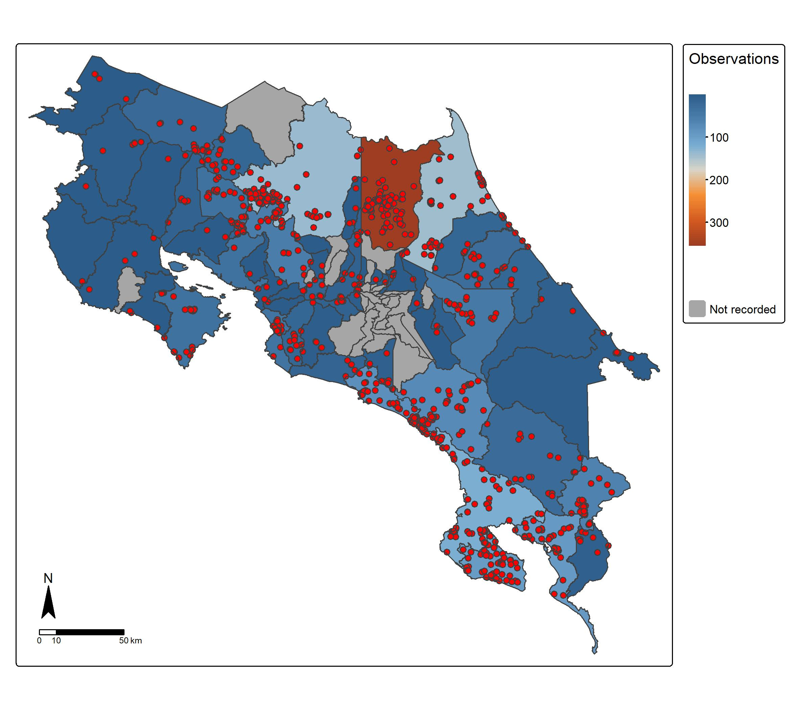

## Hector Zumbado-Ulate

I am a faculty at the [School of Biological Sciences](https://www.biologia.una.ac.cr/) since 2025. I am interested in quantifying how environmental threats (e.g., pathogens, invasive species, climate change, and habitat deterioration) drive the distribution of native species in different spatiotemporal scales. I am also interested in identifying the environmental factors (biotic and abiotic) that constrain, partially or totally, the negative effect of threats on endangered species. For this, I use a combination of spatial analyses, geographic information systems, and niche modeling.

## RESEARCH EXPERIENCE

Postdoctoral Scholar
Department of Entomoly
Center for Conservation Biology
University of California Riverside

## EDUCATION

PhD Ecology and Evolutionary Biology
Purdue University

MS Biology
University of Costa Rica

BS Biology
University of Costa Rica

## LANGUAGES

* Spanish (Native)
* English (Proficient)

## CONTACT INFORMATION:

* [email](mailto:zumbadohector@gmail.com)
* [GitHub](https://github.com/hzumbado/)
* [LinkedIn](https://www.linkedin.com/feed/?trk=guest_homepage-basic_nav-header-signin)
* ORCID: 0000-0001-7039-9967
* [Google Scholar](https://scholar.google.com/citations?user=UZ2YHecAAAAJ&hl=en)

## Map of UC Boulder

<embed type="text/html" src="maps/ucb.html" width="600" height="600">

## Map of Universidad Nacional

<embed type="text/html" src="maps/una.html" width="600" height="600">

## Distribution of _Craugastor fitzingeri_

